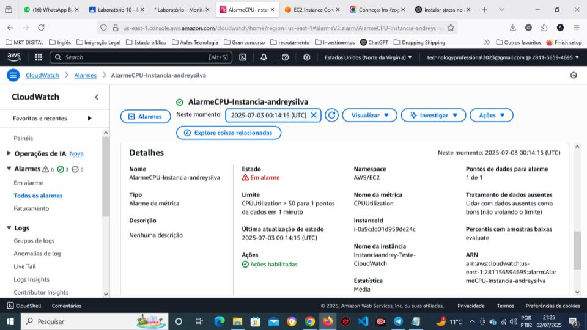
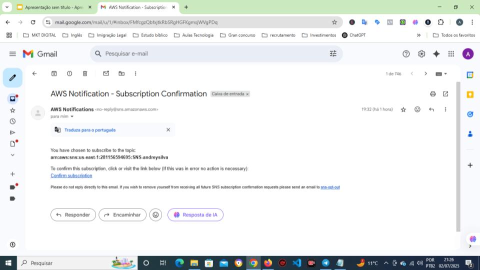
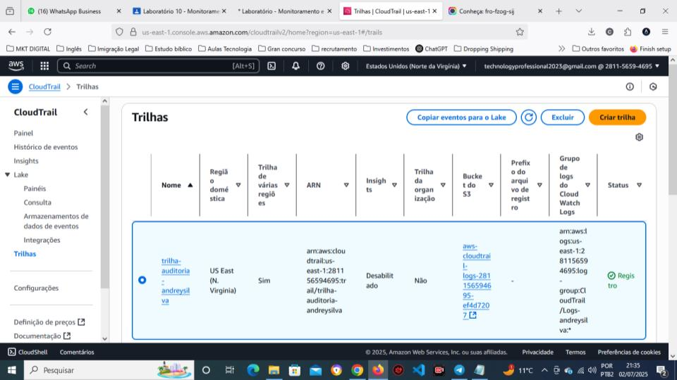
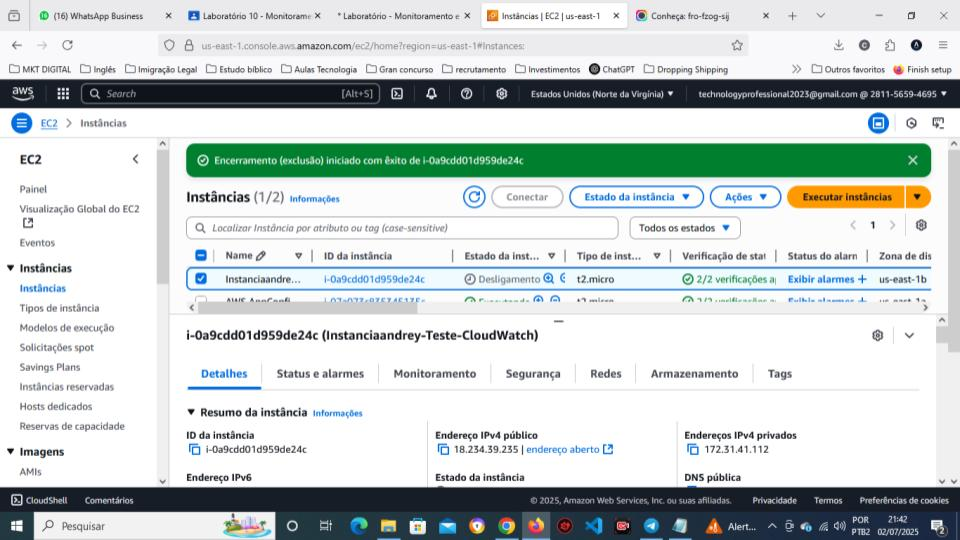
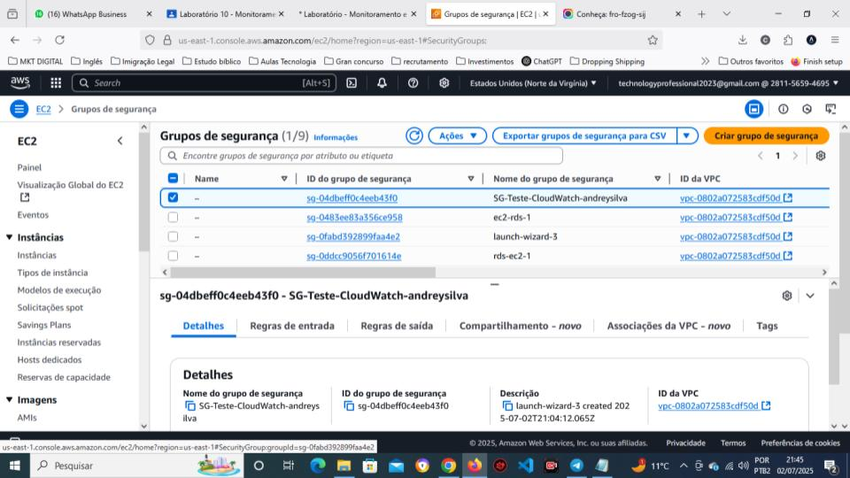

# Monitoramento-e-Auditoria-com-CloudWatch-e-CloudTrail-na-AWS
Criação de um ambiente de monitoramento e auditoria na AWS, rastream...

# 📊 Monitoramento e Auditoria com CloudWatch e CloudTrail na AWS

## 📌 Descrição
Este laboratório prático orienta a criação de um ambiente de monitoramento e auditoria na
AWS. Houve configuração alarmes para monitorar a utilização de CPU em uma
instância EC2, habilitar o rastreamento de atividades da conta com o AWS CloudTrail e
visualizar logs armazenados em um bucket S3. O exercício também inclui o envio de
notificações por e-mail usando o Amazon SNS

---
## 🚀 Tecnologias Utilizadas
- **Linguagem:** Python 3.10  
- **Cloud:** AWS (CloudWatch, CloudTrail, Bucket S3, EC2, Amazon SNS)  
 
---
## 🎯 Objetivos do Projeto
- ✅ Alarme CloudWatch: Monitorar a CPU de uma instância EC2 e enviar notificações por e-mail (SNS) quando um limite for atingido.  
- ✅ CloudTrail: Habilitar a auditoria (rastreamento de eventos) na sua conta AWS e armazenar os logs em um bucket S3 
- ✅ Visualização de Logs: Acessar os logs do CloudTrail via S3 ou CloudWatch Logs. 
---

## Cenário

É necessário monitorar o desempenho de uma instância EC2 e ser alertado sobre alta
utilização de CPU. Também é necessário manter um registro de auditoria de todas as
atividades na sua conta AWS para segurança e conformidade.

---

## Pré-requisitos

• Conta AWS ativa com permissões para EC2, CloudWatch, CloudTrail, SNS e S3.
• Permissões IAM necessárias:
o CloudWatchFullAccess
o AWSCloudTrail_FullAccess
o AmazonSNSFullAccess
o AmazonS3FullAccess
o AmazonEC2FullAccess
• Par de chaves para acesso via SSH à instância EC2.

---

## 📂 Estrutura do Projeto
📁 Monitoramento-e-Auditoria-com-CloudWatch-e-CloudTrail-na-AWS

├── 📄 README.md <- Documentação do projeto

├── 📄 requirements.txt <- Dependências do Python

├── 📄 main.py <- Script principal

├── 📁 notebooks/ <- Jupyter Notebooks de exploração

└── 📁 src/ <- Código-fonte organizado

## 📊 Resultados

---

---

---

---

---

---
## 📎 Links Importantes
- 🔗 **Portfólio:** [https://seuusuario.github.io/portfolio](https://seuusuario.github.io/portfolio)  
- 🔗 **LinkedIn:** https://www.linkedin.com/in/techprofessional-AndreySilva/ 
- 🔗 **GitHub:** https://github.com/Andrey-Silva-Data
---

## 📜 Licença
© 2025 Andrey Silva - Todos os direitos reservados.
